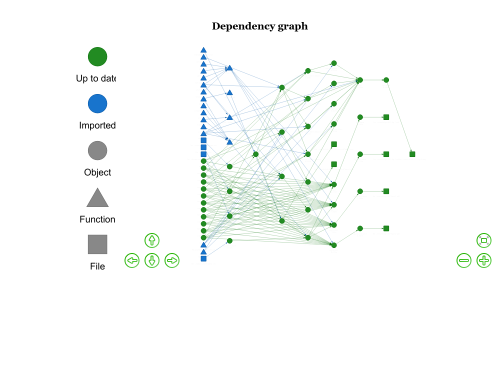

# Profiling global cancer incidence and mortality by socioeconomic development

Joannie Lortet-Tieulent PhD, Damien Georges MSc, Freddie Bray PhD, Salvatore Vaccarella PhD

International Agency for Research on Cancer, World Health Organization, Lyon, France

This repository contains all the source code that have been used for the **Profiling global cancer incidence and mortality by socioeconomic development** paper (in prep.)

## Data 

### EdI

Table containing EdI value per country.

- source: [United Nations Development program website](http://hdr.undp.org/en/data)

- script for file generation: [01_001_compute_EdI.R](scripts/01_002_compute_EdI.R)

- file: [EdI.csv](data/EdI.csv)


### Cancer Incidence and Mortality ASR

Table containing Cancer Incidence and Mortality ASR per country/cancer type/sex/.

- source: [GCO cancer today website](https://gco.iarc.fr/today/home)

- script for file generation: [01_002_compute_globocan_ASR.R](scripts/01_002_compute_globocan_ASR.R)

- file: [ASR_globocan.csv](data/ASR_globocan.csv)


### MISC

- [countries_to_highlight.csv](data/countries_to_highlight.csv): The counties to label in fig1

- [outliers.table.csv](data/outliers.table.csv): The countries we do not want to display as point but as text in the scatter plots (fig2, figS1, figS2)

## Scripts

The analysis have been conducted using [R 3.6.1](https://cran.r-project.org/) software.

All the scripts are stored within `scripts` directory

The detailed workflow is shown below



**interactive verstion** [ediglobocan-graph.html](docs/ediglobocan-graph.html)


### 02-001_ediglobocan_make.R

This is the main script.

The whole analysis outputs can be produced in R:

```R
Rscript scripts/02-001_ediglobocan_make.R
```

### 02-002_ediglobocan_functions.R

Contains a set of functions used within the main script.


### 01_001_compute_EdI.R

Production of [EdI.csv](data/EdI.csv) file.

### 01_002_compute_globocan_ASR.R

Production of [ASR_globocan.csv](data/ASR_globocan.csv) file.

## Outputs

Manuscript figs and tables are stored in [results](results) directory.


